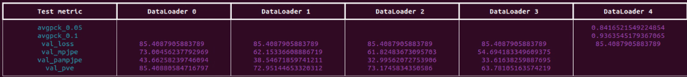

# Training CameraHMR

## Data
To run training you need to first download [BEDLAM](https://bedlam.is.tue.mpg.de), [AGORA](https://agora.is.tue.mpg.de) and [4DHumans](https://camerahmr.is.tue.mpg.de) dataset.
To download BEDLAM and AGORA training images and ground truth SMPL labels, run the following script. Since, the data size is huge it will take a while to finish. Please first register on BEDLAM website.

```
bash scripts/fetch_bedlam_training_data.sh
```

You can download the training labels (fitted SMPL parameters) for **INSTA/AIC/COCO/MPII images** from the [CameraHMR website](https://camerahmr.is.tue.mpg.de/index.html) (registration required) using the following script. The following script also download utility-files needed for training.

```
bash scripts/fetch_4dhumans_training_labels.sh
```

> **Note:** We cannot provide the original AIC/INSTA/COCO/MPII images. These images must be obtained from their original sources. For convenience, you can use the [4D-Humans repository](https://github.com/shubham-goel/4D-Humans?tab=readme-ov-file), which offers these images in WebDataset format. To extract images from the WebDataset, refer to [this script](../core/utils/extract_images_from4dhumans.py).

The images could be downloaded and stored in **data/training-images**. This is the default directory structure for the images. If you have stored images at other location you could modify the path of the images [here](../core/configs/__init__.py)

```
├── aic
│   └── images
│       └── aic-train
├── COCO
│   └── images
├── insta
│   └── images
│       └── insta-train
├── MPII-pose
│   └── images


```
## Run
Once the data is downloaded you can run the training with following command
```
python train.py data=train experiment=camerahmr exp_name=train_run1          

```

# Evaluation CameraHMR
## Data

To run the evaluation first you need to download the test labels for 3DPW, EMDB, RICH, SPEC-syn-test and COCO from CameraHMR website using the following script. The following script also download some utilty files needed to run the evaluation.

```
bash scripts/fetch_test_labels.sh
```

> **Note:** We cannot provide the original images for 3DPW, EMDB, RICH, SPEC-syn-test and COCO. These images must be obtained from their original sources.

The images could be downloaded and stored in **data/test-images**. This is the default directory structure for the images. If you have stored images at other location you could modify the path of the images [here](../core/configs/__init__.py)

```
├── 3DPW
│   └── imageFiles
├── COCO2017
│   └── images
│       └── val2017
├── EMDB
│   ├── P0
│   ├── P1
│   ├── P2
│   ├── P3
│   ├── P4
│   ├── P5
│   ├── P6
│   ├── P7
│   ├── P8
│   └── P9
├── RICH
│   └── test
└── spec-syn
    └── images
```
    

## Run
Once the data is downloaded you can run the evaluation with following command. Note that you also need to download the pretrained-checkpoint data using **fetch_demo_data.sh** script.

```
python eval.py data=eval experiment=camerahmr  
```

### Expected Result:
  
*Figure: CameraHMR Evaluation Results*

The output results are aligned with the mapping of DataLoaders to their corresponding datasets as follows:  
- **Dataloader 0**: EMDB  
- **Dataloader 1**: 3DPW  
- **Dataloader 2**: SPEC  
- **Dataloader 3**: RICH  
- **Dataloader 4**: COCO  


# Training DenseKP
To train the model, ensure that the BEDLAM and AGORA training images and labels are downloaded. For evaluation, download the EMDB images and labels. Refer to the data downloading instructions above for details.

Once you have the data downloaded, the training could be run with following command. 

```
python train_keypoints.py data=densekp_train experiment=densekp exp_name=train_densekp_run1       
```

# Demo DenseKP
To run the demo on example images, download the pretrained checkpoint from the [CameraHMR](https://camerahmr.is.tue.mpg.de) website. You can find it in the **Download** page under **Checkpoint** section. Then, use the following command to provide the path to the checkpoint and execute the demo.

```
python demo_keypoints.py --ckpt path_to_densekp_checkpoint
```

# CamSMPLify
Please refer to [CamSMPLify](CamSMPLify/ReadMe.md) for detailed instructions on running CamSMPLify.